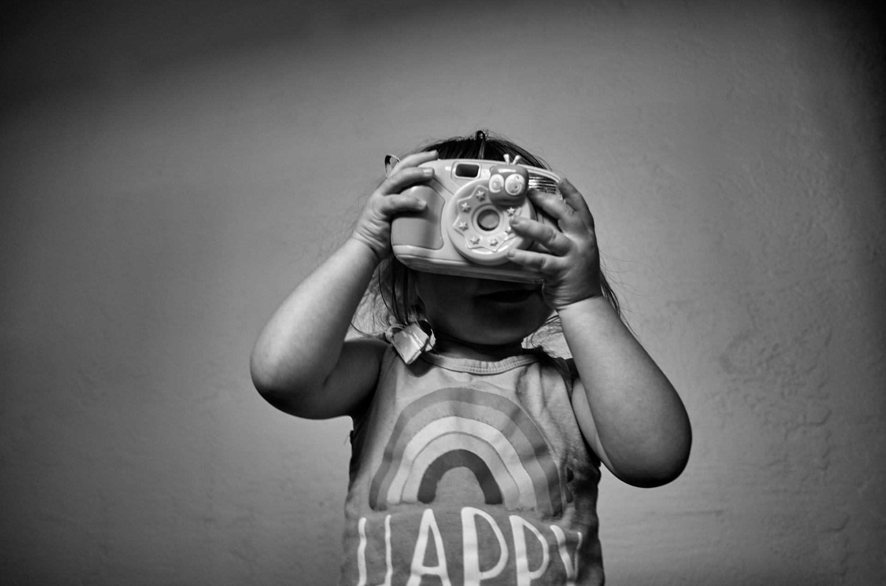

I intend to process and share 1 photo from from 4 weeks ago each day.

My daughter, Aster, playing with her toy camera. Each day, I engage in an internal debate about what day to give her a real one. When I do, should it be a Fisher Price tank-camera, built for throwing at things? Should it be a film camera with minimal controls and feedback? Should it be a $5 point-and-shoot from the thrift store so she can focus on framing/composition instead of controls?

*Ricoh GR 2. 18mm. ISO 400. 1/60s. f/2.8. Natural light.*

